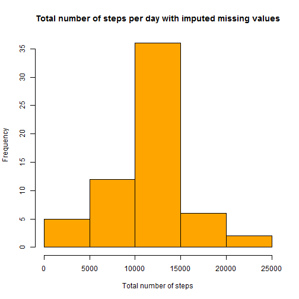

## PART 1: Loading  and Processing the Data

The data is loaded from the working directory into a dataframe called **assignment** using csv.read. This data frame contains three variables, which are:

1. steps:  Number of steps taking in a 5-minute interval 
2. date : The date on which the measurement was taken in YYYY-MM-DD format
3. interval :  Identifier for the 5-minute interval in which measurement was taken


```r
assignment<-read.csv("activity.csv")
```


##PART 2: Total Number of Steps Per Day


###*Total number of steps each day*

The total number of steps per each day is calculted by using the aggregate command. This is shown in the code below. 


```r
steps_total<-aggregate(list(steps_total=assignment$steps), by=list(date=assignment$date),  FUN=sum, na.rm=TRUE)
```

The result is saved in a new data frame called **steps_total**.This data frame contains the total number of steps for each of the 61 days for which the analysis is being carried out. The observation that are NA are excluded from the total using the na.rm=TRUE argument.


##*Histogram*

A histrogram is a graphical representation of distribution of data.  The  histogram below illustrates the frequency of total number of steps in a day. In the sample data, a higher proportion of the total number of steps in a day are about 10000 to 15000 steps.  


```r
hist(steps_total$steps_total, col="dark red" ,main= "Total number of steps per day", xlab="Number of Steps")
```

 


```r
mean_steps=mean(steps_total$steps)
median_steps=median(steps_total$steps)
mean_steps
```

```
## [1] 9354.23
```

```r
median_steps
```

```
## [1] 10395
```

The mean nember of total steps is equal to 9354.2295082 and the median is 10395. 


##PART 3: Average Daily Activity Pattern

### *Mean steps in an Interval*

The data is collected for 5 minute intervals. The code below calculates the mean number of steps for each interval.

A plot of the average steps against the 5 minute interval below, shows that the mean number of steps is very low in the initial intervals. There is an increase after the 500 interval, and starts decreasing after the 2000 interval.


```r
steps_mean_interval<-aggregate(list(steps_mean=assignment$steps), by=list(interval=assignment$interval),  FUN=mean, na.rm=TRUE)


plot(steps_mean_interval$interval, steps_mean_interval$steps_mean, type="l",lwd=5, col="green", xlab="5 mins interval", ylab="Average steps" ,main="Average Daily Activity")
```

 


### *Maximum Steps*


```r
max_steps<-max(steps_mean_interval$steps_mean)
max_row<-which.max(steps_mean_interval$steps_mean)
steps_mean_interval[max_row, "interval"]
```

```
## [1] 835
```

The maximum number of mean steps in a 5 minute interval is 206.1698113 which occurs when the interval value is 835.  

##PART 4: Imputing Missing Values


###*Total number of missing values*


```r
missing_values<-sum(is.na(assignment))
```

The code above counts the number of missing values in the data. There are a total of 2304 in the data frame. All of  these values are in the **steps** variable.

###*Strategy for Imputing missing values*

Missing values can be replaced with the interval mean values in order to have a complete data set.

This is achieved in a few major steps, which are:

. Step 1: Identifying rows with missing values

. Step 2: Incase, of missing values, identifying the the interval value for which the steps value is missing(**step_interval**)

. Step 3: Next step is to identify the row numbers of to the interval values identified in the last step in  the data set which contains the mean value of steps for each interval(**mean_row**)

. Step 4: Generate a variable (**mean_value**) which is rqual to the value at the **mean_row**  row num ber and **steps_mean** column(mean number of steps for each interval) from the interval mean data set

. Step 5: The final step is to assign the mean values from the previous step to the missing observation 


###*New Dataset*

A new data set **new_data** is assigned the same values as the data set **assignment**. Missing values are imputed to this data, as described above.


```r
new_data<-assignment

for (row in 1:nrow(new_data)) 
{
  step= new_data[row, "steps"]
  
  if (is.na(step))
  {
    step_interval=new_data[row, "interval"]
    mean_row<-which(steps_mean_interval$interval== step_interval)
    mean_value<- steps_mean_interval[mean_row, "steps_mean"]
      
    if (is.nan(mean_value))
    {
      print("Error Invalid Mean ")
    } 
    else
    {
      new_data[row,"steps"]= mean_value
            
    }
  }
}
```


###*Total number of steps*

Total number of steps is  calculated  the same way as it was without imputed missing values. 


```r
steps_total_nomissing<-aggregate(list(steps=new_data$steps), by=list(date=new_data$date),  FUN=sum, na.rm=TRUE)
```


A histogram of these values shows more normal distribution. Although, the most occuring number of total steps in a day remain between 10000 to 15000. See below.


```r
hist(steps_total_nomissing$steps, col="orange", xlab="Total number of steps", main="Total number of steps per day with imputed missing values")
```

 


```r
mean_nomissing=mean(steps_total_nomissing$steps)
median_nomissing=median(steps_total_nomissing$steps)
mean_nomissing
```

```
## [1] 10766.19
```

```r
median_nomissing
```

```
## [1] 10766.19
```

The mean and median both have a value of 10766.19. There was a higher difference between the median and the mean before imputing the missing values.

##PART 5: Activity Patterns Between Weekdays and Weekends


### *Weekend and Wekday Variable*

The code below creates a factor variable which takes two values: weekdays and weekend. First, the **timeDate** package is installed. The class of the date variable is converted to *Date*.

The **isWeekday** amd **isWeekend** functions are used in addtion with ** which** to identify rows for which the day is a weekday and a weekend. These two functions used alone return TRUE and FLASE.

Once the weekend and weekday rows have been identified a new variable **day** is generated and assigned value labels. 


```r
#install.packages("timeDate")
library("timeDate")

new_data$date<-as.Date(new_data$date)

  weekday_row=which(isWeekday(new_data$date, wday=1:5))
  weekend_row=which(isWeekend(new_data$date, wday=1:5))
  
  new_data$day=0
  new_data[weekday_row, "day"]=1 
  new_data[weekend_row, "day"]=2
  
  new_data$day <- factor(new_data$day,
                     levels = c(1,2),
                     labels = c("weekdays", "weekend"))
```


###*Comparison of Weekdays and Weekend Activities*

A new dataframe is created with the mean number of steps for each 5 minute interval for two categories:weekday and weekend. The code below uses the **aggregate** command to calculate the mean values.


```r
steps_mean_interval_nomissing<-aggregate(steps~interval+day, data=new_data, FUN=function(x) (mean=mean(x)))
```

The plot below shows the trend of mean number of steps for 5 minute intervals during the weekend and weekdays. 

During the initial 5 minute intervals mean number of steps is close to zero on weekdays and on weekends. On the weekdays, the number of steps starts increasing after the 500 minute interval, whereas on the weekends it remains low till about 900 minutes. 

The mean number of steps are as high as about 206 steps on weekdays, where as in the weekends the maximum number of mean steps is abot 150 steps.


```r
library (lattice)

xyplot ( steps~ interval| day,  data=steps_mean_interval_nomissing, type="l", lwd="5",layout=c(1, 2), xlab="Interval", ylab="Average Steps")
```

 


